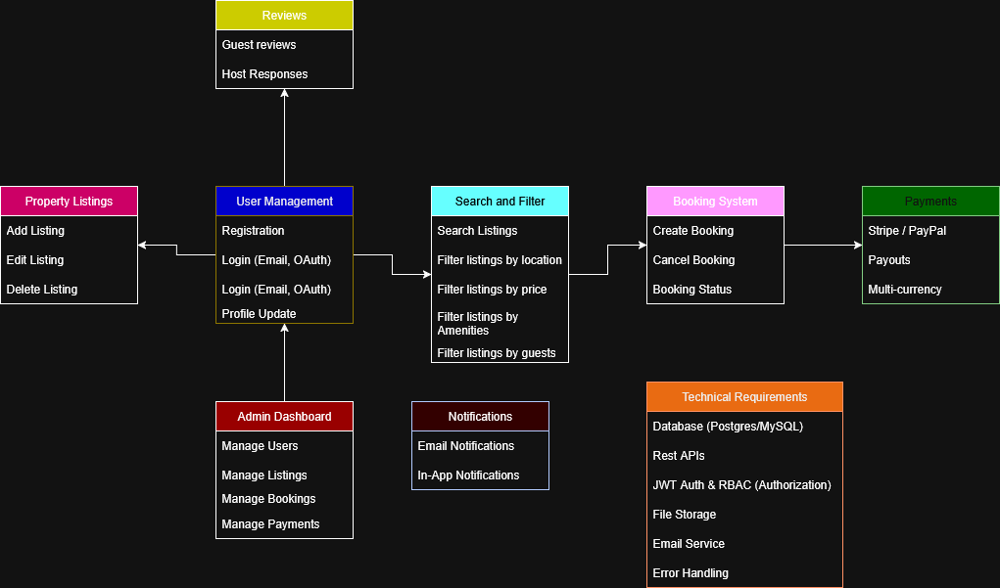

# 📊 Use Case Diagram

This diagram visualizes the different features and functionalities the backend system should support. It highlights key functionalities such as registration, property booking, payments, and admin management, and also uses arrowws to portray a minimalistic user interaction flow.

