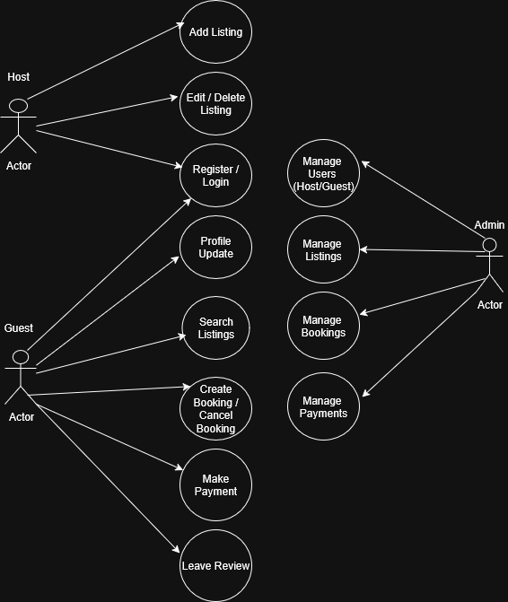

# 📊 Use Case Diagram

This diagram visualizes how different users (Guest, Host, Admin) interact with the Airbnb Clone backend system. It highlights key functionalities such as registration, property booking, payments, and admin management.

